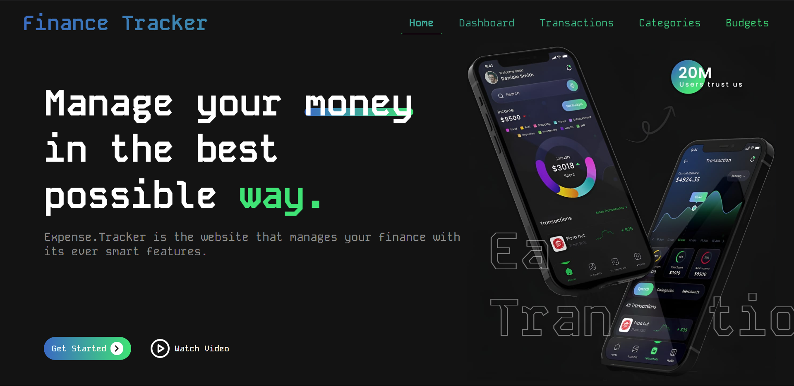
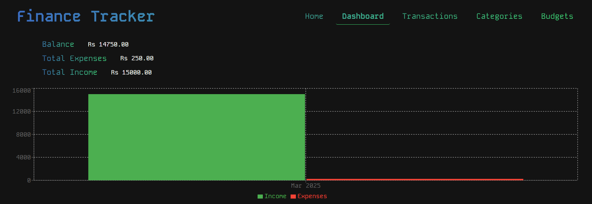
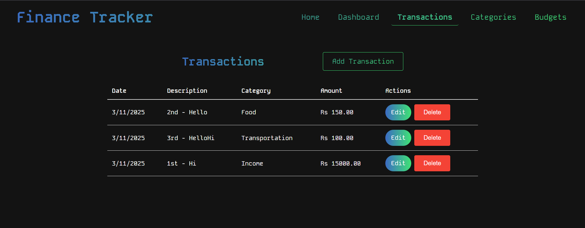
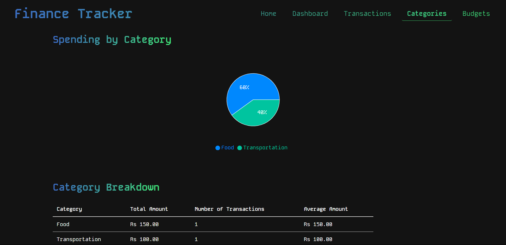
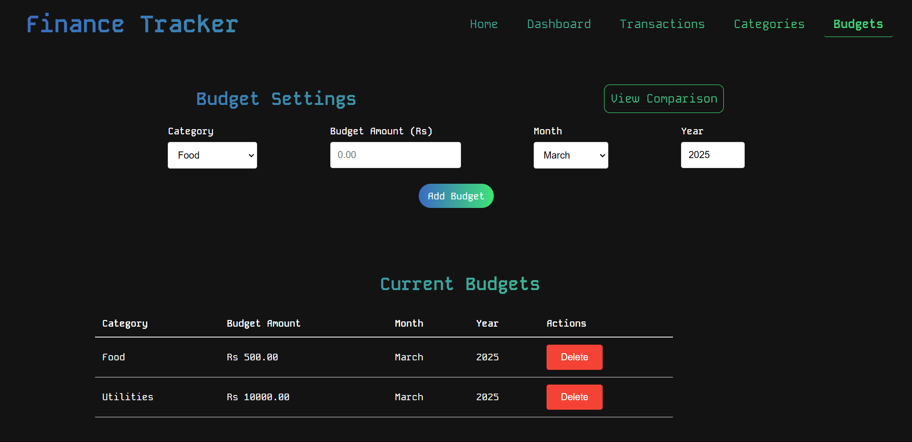

# 💰 Personal Finance Tracker 📊 (MERN Stack)

This is a personal finance tracker application built using the **MERN stack**: **M**ongoDB, **E**xpress.js, **R**eact (Vite), and **N**ode.js. It allows users to manage their transactions, set budgets, and view spending summaries.

## ✨ Features

-   **🧾 Transaction Management:**
    -   ➕ Add, ✏️ edit, and 🗑️ delete transactions.
    -   📋 View a list of all transactions with details like date, description, category, and amount.
-   **📈 Budgeting:**
    -   📅 Set monthly budgets for different categories.
    -   📊 View a comparison of budgeted vs. actual spending.
-   **📊 Spending Summaries:**
    -   📈 Visualize spending by category using charts.
    -   🧾 View detailed category breakdowns with total amounts, transaction counts, and average amounts.
-   **💻 User-friendly Interface:**
    -   ✨ Clean and intuitive design for easy navigation and use.

## 🛠️ Technologies Used (MERN Stack)

-   **Frontend:**
    -   ⚛️ React (Vite)
    -   📡 Axios (for API requests)
    -   🛣️ React Router (for navigation)
    -   📈 Recharts (for charts)
-   **Backend:**
    -   ⚙️ Node.js
    -   🚀 Express.js
    -   💾 MongoDB (for database)
    -   🐘 Mongoose (for MongoDB object modeling)
-   **⚙️ Environment Variables:**
    -   Vite (.env) for frontend configuration.

## 🚀 Usage

-   **🧾 Transactions:**
    -   Use the "Add Transaction" button to add new transactions.
    -   Edit or delete existing transactions from the transaction list.
-   **📈 Budgets:**
    -   Set budgets for different categories using the budget settings page.
    -   View budget comparisons to see how your actual spending compares to your budget.
-   **📊 Summaries:**
    -   View spending summaries by category using charts and detailed breakdowns.

## 🤝 Contributing

Contributions are welcome! Please feel free to submit a pull request.

## 📸 Screenshots











## ⚙️ Setup Instructions (Frontend)

To run the frontend of this application, follow these steps:

1.  **Clone the Repository:**

    ```bash
    git clone https://github.com/SamP231004/Yardstick_Finance-Visualizer
    ```

2.  **Navigate to the Frontend Directory:**

    ```bash
    cd Frontend
    ```

3.  **Install Dependencies:**

    ```bash
    npm install
    ```

4.  **Create the `.env` File:**

    * In the `Frontend` directory, create a new file named `.env`.
    * Add the following line to the `.env` file, replacing the URL with your backend API URL. If you are using the provided render URL, then use that.

        ```
        VITE_API_BASE_URL=https://yardstick-finance-visualizer.onrender.com
        ```

5.  **Start the Development Server:**

    ```bash
    npm run dev
    ```

    This will start the React development server. Open your browser to view the application.